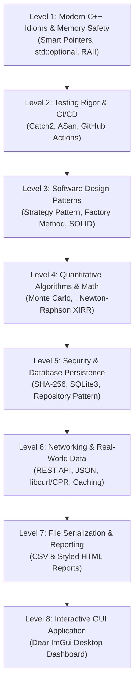

# MutualMind — Master Learning Progression & Resume-Building Roadmap

> **Philosophy:** Learn by building. Each milestone teaches you a fundamental computer science and C++ engineering concept, immediately applies it to the codebase, and unlocks a verified bullet point on your resume.

---

## 🧭 Your Path from Student C++ to Industry-Ready Software Engineer



---

## 📚 Master Curriculum (Priority & Step-by-Step Progression)

---

### 🟢 Level 1: Modern C++ Idioms, Memory Safety & RAII
* **Priority:** `P0` (Essential Foundation)
* **Theme:** Transitioning from "C-with-classes" to idiomatic C++17.

#### 1. What You Will Learn
* **RAII (Resource Acquisition Is Initialization):** Why manual resource management is dangerous and how C++ handles automatic cleanup through deterministic destructors.
* **Smart Pointers (`std::unique_ptr` & `std::shared_ptr`):** Expressing clear ownership semantics without raw pointers.
* **Modern Standard Library Utilities:**
  - `std::optional<T>`: How to represent "value or nothing" safely instead of error codes or sentinel values.
  - `std::string_view`: Zero-allocation read-only string slices.
  - Move semantics (`std::move`): Avoiding expensive deep copies.

#### 2. Best Free Learning Resources
* [LearnCpp.com — Chapter 19: Move Semantics & Smart Pointers](https://www.learncpp.com/cpp-tutorial/introduction-to-smart-pointers-move-semantics/)
* [LearnCpp.com — Chapter 16: std::optional](https://www.learncpp.com/cpp-tutorial/stdoptional/)

#### 3. Hands-On Application in MutualMind
* Refactor [UserAuth](file:///c:/Users/A/OneDrive/Desktop/MUTUAL%20MIND/src/UserAuth.cpp) and lookup methods to return `std::optional<User>` instead of boolean flags.
* Replace raw string copies with `const std::string&` and `std::string_view` where appropriate.
* Wrap all dynamically managed entities in `std::unique_ptr`.

#### 4. Resume & Interview Value
* **Interview Question You Can Answer:** *"What is RAII, and why does modern C++ forbid manual `new`/`delete` in application code?"*
* **Resume Bullet:** *Refactored legacy memory management to modern C++17 RAII standards utilizing smart pointers (`std::unique_ptr`) and `std::optional` to guarantee zero resource leaks.*

---

### 🟢 Level 2: Test-Driven Development (TDD) & CI/CD Automation
* **Priority:** `P0` (Critical Engineering Rigor)
* **Theme:** Never break working code; prove correctness automatically.

#### 1. What You Will Learn
* **Modern CMake Architecture:** How to use `FetchContent` to download and link third-party libraries automatically without manually placing header files.
* **Unit Testing Principles:** Writing deterministic test cases, testing boundary conditions (e.g., negative amounts, 0% interest, boundary scores).
* **AddressSanitizer (ASan):** How compiler sanitizers catch buffer overflows, memory leaks, and undefined behavior at runtime.
* **Continuous Integration (CI):** Setting up automated multi-platform builds using GitHub Actions.

#### 2. Best Free Learning Resources
* [Catch2 Official Tutorial & Quickstart](https://github.com/catchorg/Catch2/blob/devel/docs/tutorial.md)
* [GitHub Actions for C/C++ by GitHub Docs](https://docs.github.com/en/actions/automating-builds-and-tests/building-and-testing-net)

#### 3. Hands-On Application in MutualMind
* Add Catch2 to [CMakeLists.txt](file:///c:/Users/A/OneDrive/Desktop/MUTUAL%20MIND/CMakeLists.txt) using `FetchContent`.
* Create a dedicated `tests/` directory with:
  - `Test_FinanceMath.cpp`: Edge cases for `calculateFutureValue()` (0% interest, large values, 40-year horizons).
  - `Test_RiskAssessor.cpp`: Boundary score verification for `Conservative`, `Moderate`, `Aggressive`.
* Configure `-fsanitize=address,undefined` in debug builds.
* Add `.github/workflows/ci.yml` so every git push runs your tests on Ubuntu and Windows.

#### 4. Resume & Interview Value
* **Interview Question You Can Answer:** *"How do you verify edge cases in financial calculations, and how do you ensure code stability across pull requests?"*
* **Resume Bullet:** *Architected an automated testing pipeline using **Catch2** and **GitHub Actions CI**, enforcing regression prevention and zero memory leaks via **AddressSanitizer (ASan)**.*

---

### 🟢 Level 3: Real-World Design Patterns (GoF) & Architecture
* **Priority:** `P0` (Architecture & SOLID Principles)
* **Theme:** Writing flexible, modular, extensible code instead of rigid `if/else` blocks.

#### 1. What You Will Learn
* **Strategy Pattern:** How to define a family of algorithms, encapsulate each one, and make them interchangeable at runtime.
* **Factory Method Pattern:** How to decouple object creation from object usage.
* **Open/Closed Principle (OCP):** Designing code that is *open for extension* (new strategies) but *closed for modification* (existing code doesn't change).

#### 2. Best Free Learning Resources
* [Refactoring.Guru — Strategy Pattern in C++](https://refactoring.guru/design-patterns/strategy/cpp/example)
* [Refactoring.Guru — Factory Method Pattern in C++](https://refactoring.guru/design-patterns/factory-method/cpp/example)

#### 3. Hands-On Application in MutualMind
* Replace the hardcoded `RiskProfile` table with an abstract strategy interface:
  ```cpp
  class IAllocationStrategy {
  public:
      virtual ~IAllocationStrategy() = default;
      virtual AssetAllocation calculateAllocation(double monthlyAmount, int age) const = 0;
      virtual std::string getStrategyName() const = 0;
  };
  ```
* Implement concrete strategies:
  - `ConservativeStrategy` (Debt-heavy)
  - `ModerateStrategy` (Balanced Hybrid)
  - `AggressiveStrategy` (Equity/Small-cap heavy)
  - `AgeBasedGlideslopeStrategy` (Dynamic: Equity % = $100 - \text{Age}$)
* Implement `AllocationStrategyFactory` that returns `std::unique_ptr<IAllocationStrategy>`.

#### 4. Resume & Interview Value
* **Interview Question You Can Answer:** *"How would you design a portfolio recommendation engine such that a product manager can add 10 new investment profiles without altering existing codebase logic?"*
* **Resume Bullet:** *Engineered an extensible portfolio allocation engine leveraging the **GoF Strategy & Factory patterns**, decoupling business logic from presentation and adhering to SOLID design principles.*

---

### 🟡 Level 4: Quantitative Algorithms & Probabilistic Modeling
* **Priority:** `P1` (Quantitative Edge)
* **Theme:** Replacing toy compound interest with realistic stochastic modeling.

#### 1. What You Will Learn
* **Monte Carlo Simulation:** Why static return projections (e.g. "you get 12% every year") fail in the real world, and how randomized walk simulations model volatility.
* **Modern C++ `<random>` Library:** Why `rand()` is considered harmful; how to use `std::mt19937` (Mersenne Twister) and `std::normal_distribution` for statistically sound simulations.
* **Numerical Methods (Newton-Raphson):** How root-finding algorithms solve for internal rate of return (XIRR) when equations cannot be solved analytically.
* **Step-Up SIP & Real vs Nominal Purchasing Power:** Modeling inflation and annual salary step-ups.

#### 2. Best Free Learning Resources
* [LearnCpp.com — Generating Random Numbers using `<random>`](https://www.learncpp.com/cpp-tutorial/generating-random-numbers-using-mersenne-twister/)
* [Khan Academy / Brilliant — Monte Carlo Methods](https://en.wikipedia.org/wiki/Monte_Carlo_method)

#### 3. Hands-On Application in MutualMind
* Create `MonteCarloSimulator` class:
  - Runs **1,000 to 10,000 simulation paths** based on historical mean ($\mu$) and standard deviation ($\sigma$).
  - Outputs the **10th percentile (Bear Market)**, **50th percentile (Median)**, and **90th percentile (Bull Market)**.
  - Calculates probability of capital loss: $P(\text{Final Value} < \text{Invested Amount})$.
* Implement **Step-Up SIP calculation** (annual increment of $+X\%$).

#### 4. Resume & Interview Value
* **Interview Question You Can Answer:** *"How do you simulate market uncertainty in an investment projection, and why is `std::mt19937` preferred over `rand()`?"*
* **Resume Bullet:** *Developed a **Monte Carlo simulation engine** utilizing C++ `<random>` normal distributions to project 10,000+ probabilistic investment paths, delivering 10th/50th/90th percentile risk analysis.*

---

### 🟡 Level 5: Security, Persistence & Relational Databases
* **Priority:** `P1` (Production Data Handling)
* **Theme:** Moving from plaintext file parsing to real relational databases and cryptography.

#### 1. What You Will Learn
* **Cryptographic Security Basics:** Why passwords must never be stored in plaintext or reversible encryption; the role of **hashing** and **cryptographic salt** (preventing rainbow table attacks).
* **Embedded Relational Databases (SQLite3):** How embedded SQL databases operate, ACID transactions, and why they outperform raw text files.
* **The Repository Pattern:** Decoupling the data layer (`IUserRepository`) from the domain layer so storage backends can be swapped without touching business logic.
* **RAII SQLite Wrappers:** Wrapping `sqlite3*` and `sqlite3_stmt*` so queries automatically finalize and database handles close even if an exception occurs.

#### 2. Best Free Learning Resources
* [SQLite C/C++ Tutorial & Official API Reference](https://www.sqlite.org/cintro.html)
* [Computerphile: Password Hashing & Salts (YouTube)](https://www.youtube.com/watch?v=8ZtInClt1FE)

#### 3. Hands-On Application in MutualMind
* Replace [UserAuth.cpp](file:///c:/Users/A/OneDrive/Desktop/MUTUAL%20MIND/src/UserAuth.cpp) text file parsing with:
  - A cryptographic utility to compute salted SHA-256 digests.
  - SQLite database `mutualmind.db` with structured tables (`users`, `portfolios`).
* Implement `IUserRepository` interface and `SqliteUserRepository` class using prepared statements (`sqlite3_prepare_v2`, `sqlite3_bind_*`, `sqlite3_step`) with zero SQL injection risk.

#### 4. Resume & Interview Value
* **Interview Question You Can Answer:** *"How do you prevent SQL and delimiter injection in data persistence, and how do you store user credentials securely in C++?"*
* **Resume Bullet:** *Implemented a secure authentication and persistence layer utilizing **SQLite3** and **salted SHA-256 hashing**, applying the **Repository Pattern** and RAII query wrappers for safe resource management.*

---

### 🟡 Level 6: Networking, REST APIs & JSON Serialization
* **Priority:** `P1` (Distributed & Connected Systems)
* **Theme:** Ingesting live financial data from the internet.

#### 1. What You Will Learn
* **HTTP & REST Protocols:** Handling HTTP GET requests, status codes (200, 404, 500), and network error handling in C++.
* **Network Libraries (`cpr` or `libcurl`):** Making synchronous and asynchronous web requests in modern C++.
* **JSON Parsing (`nlohmann/json`):** Deserializing structured nested JSON responses into C++ structs.
* **Tiered Caching Strategy:** Memory Cache $\rightarrow$ SQLite Offline Database $\rightarrow$ Network Request.

#### 2. Best Free Learning Resources
* [CPR: C++ Requests (Documentation & Tutorial)](https://docs.libcpr.org/)
* [nlohmann/json GitHub & Documentation](https://github.com/nlohmann/json)

#### 3. Hands-On Application in MutualMind
* Connect to public financial endpoints (e.g., [mfapi.in](https://www.mfapi.in/) for live Indian Mutual Fund NAVs).
* Fetch historical 3-year NAV time-series.
* Calculate empirical statistics from real data:
  - **Standard Deviation ($\sigma$):** Real fund volatility.
  - **Sharpe Ratio:** True risk-adjusted returns against a risk-free benchmark rate.
  - **Maximum Drawdown (MDD):** The largest drop from historical peak to trough.
* Cache the downloaded NAV data in SQLite so the app works seamlessly offline.

#### 4. Resume & Interview Value
* **Interview Question You Can Answer:** *"How do you design an offline-first caching layer when consuming third-party REST APIs in a native application?"*
* **Resume Bullet:** *Built a resilient network ingestion subsystem with **`cpr` (libcurl)** and **`nlohmann/json`**, fetching real-time NAV time-series to compute historical volatility, Sharpe Ratio, and Maximum Drawdown with local SQLite caching.*

---

### 🔵 Level 7: Data Serialization & Multi-Format Reporting
* **Priority:** `P2` (Product Usability)
* **Theme:** Generating clean, professional reports for users.

#### 1. What You Will Learn
* **Structured File Serialization:** Formatting tabular data to compliant RFC 4180 CSV files.
* **HTML/CSS Templating:** Dynamically assembling an HTML report from C++ strings and embedding responsive CSS for printable PDF rendering.

#### 2. Hands-On Application in MutualMind
* Implement `ReportExporter`:
  - `exportToCSV(const std::string& filepath)`: Exports monthly SIP progression and Monte Carlo percentiles.
  - `exportToHTML(const std::string& filepath)`: Generates a self-contained portfolio summary report with summary metric cards, fund tables, and an interactive print stylesheet (`@media print`).

#### 3. Resume & Interview Value
* **Resume Bullet:** *Created an automated reporting engine generating structured CSV datasets and styled standalone HTML/PDF investment summaries for user portfolio tracking.*

---

### 🔵 Level 8: Interactive GUI Application (Dear ImGui)
* **Priority:** `P2` (The Visual "Showstopper")
* **Theme:** Giving your project an intuitive, interactive visual interface.

#### 1. What You Will Learn
* **Immediate-Mode GUI (IMGUI) Architecture:** How Dear ImGui differs from traditional retained-mode GUI frameworks (Qt, WinForms, web DOM); rendering frames in a game loop.
* **Graphics Contexts & Event Loops:** Initializing GLFW and OpenGL/DirectX in C++.
* **Real-time Visualization:** Plotting mathematical distributions and bar/pie graphs dynamically as sliders move.

#### 2. Best Free Learning Resources
* [Dear ImGui GitHub & Examples](https://github.com/ocornut/imgui)
* [ImPlot (Extension for charts and plots)](https://github.com/epezent/implot)

#### 3. Hands-On Application in MutualMind
* Build an intuitive desktop dashboard:
  - Sliders for monthly investment, risk quiz, tenure, and expected returns.
  - Real-time live updating graph of the Monte Carlo simulation curves using **ImPlot**.
  - Interactive asset allocation pie/bar visualization.
* Record a 15-second high-quality GIF of this dashboard to put at the top of your GitHub README.

#### 4. Resume & Interview Value
* **Resume Bullet:** *Designed an interactive real-time desktop dashboard using **Dear ImGui** and **OpenGL**, enabling live scenario modeling with dynamic Monte Carlo distribution plots.*

---

## 📅 Summary of Your Learning Checklist

| Level | Topic | Core Tech Learned | Status |
| :---: | :--- | :--- | :---: |
| **1** | Modern C++ & Memory Safety | `std::unique_ptr`, `std::optional`, RAII, Move Semantics | **Completed** |
| **2** | Testing & CI/CD | Catch2 v3, CMake `FetchContent`, ASan, GitHub Actions | **Ready** |
| **3** | GoF Design Patterns | Strategy Pattern, Factory Pattern, SOLID Principles | Next |
| **4** | Quantitative Math | Monte Carlo, `<random>` normal distributions, Newton-Raphson | Next |
| **5** | Security & Databases | Salted SHA-256, SQLite3 C API, Repository Pattern | Next |
| **6** | Networking & APIs | `cpr` (libcurl), `nlohmann/json`, HTTP Caching, Sharpe/MDD | Next |
| **7** | Export Subsystem | CSV generation, Self-contained HTML/CSS Reports | Next |
| **8** | Interactive GUI | Dear ImGui, OpenGL/GLFW, ImPlot, Event Loop | Next |

---

## 🚀 How We Will Work Together

Whenever you are ready to begin, simply tell me:
> *"Let's start Level 1: Modern C++ and Smart Pointers."*

I will:
1. **Explain the concepts simply** with short, crystal-clear code examples.
2. **Guide you through refactoring** the existing code in MutualMind step-by-step.
3. **Show you how to test it**, verify it, and add it to your portfolio.
